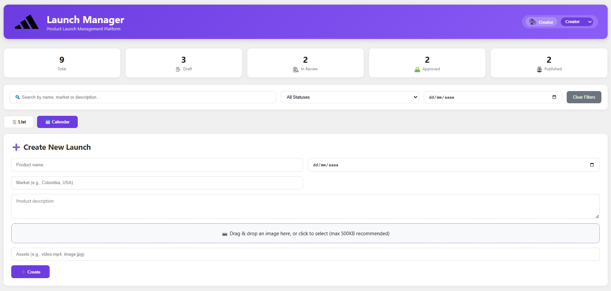
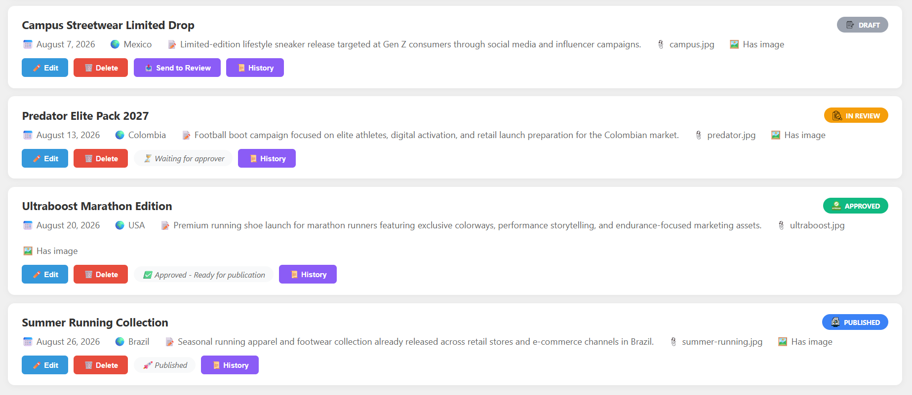
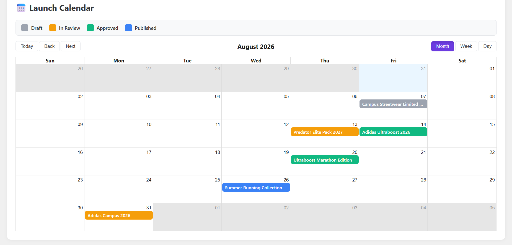
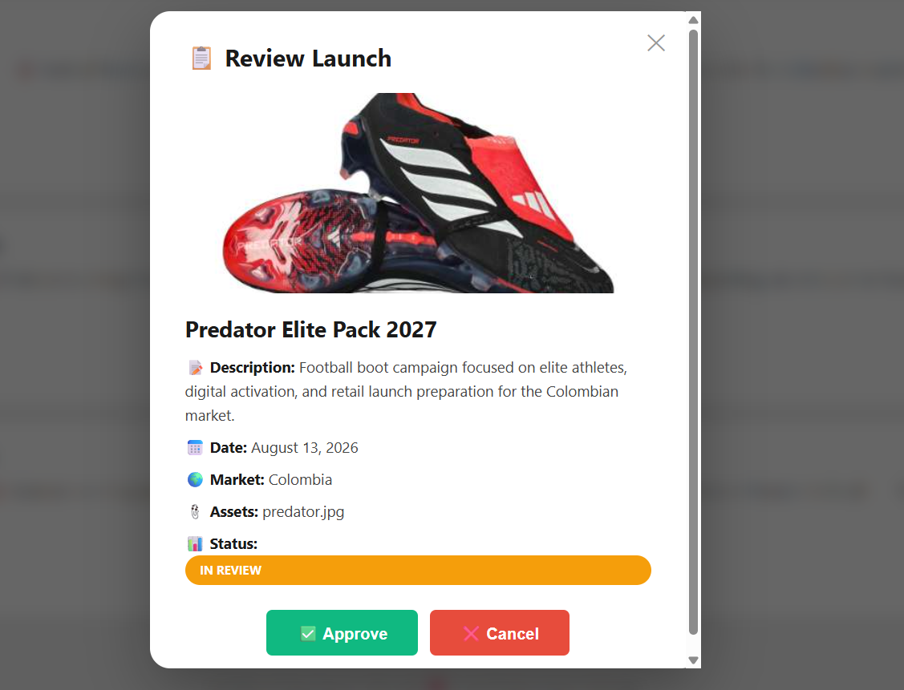
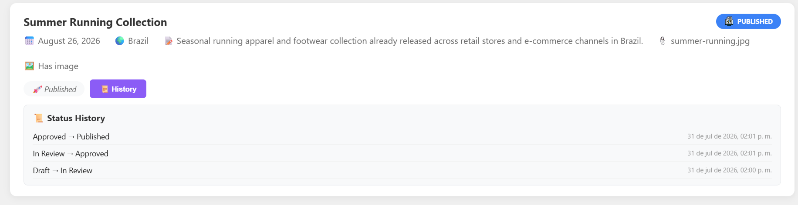

# Adidas Launch Manager

**Technical Challenge Submission – enGlobe_Connect 2026**

---

## Project Overview

Adidas Launch Manager is a web application designed to support marketing teams in planning, reviewing, approving, and publishing product launches. The project was developed individually as part of the **enGlobe_Connect 2026** technical challenge.

The application provides a complete launch workflow, role-based actions, visual status management, and a calendar view for upcoming releases.

---

## Main Features

* Create, edit, and delete product launches
* Product image and description support
* Role-based interface (**Creator** and **Approver**)
* Launch workflow:

  * Draft
  * In Review
  * Approved
  * Published
* Status transition validation in the backend
* Status history tracking (audit trail)
* Search and filtering by market, status, and date
* Calendar view of upcoming launches
* Responsive user interface

---

## Role Overview

The application uses two distinct roles:

| Role         | Permissions                                                            |
| ------------ | ---------------------------------------------------------------------- |
| **Creator**  | Create, edit, and delete launches. Can send drafts for review.         |
| **Approver** | Review, approve, and publish launches. Cannot create or edit launches. |

This separation ensures that only authorized users can modify launch statuses.

---

## Technologies Used

### Frontend

* React
* Vite
* Axios
* React Big Calendar
* CSS3

### Backend

* Node.js
* Express
* SQLite

---

## Project Structure

```text
Adidas-Launch-Manager/
├── backend/
│   ├── launches.db
│   ├── package.json
│   └── server.js
├── frontend/
│   ├── public/
│   ├── src/
│   │   ├── assets/
│   │   ├── App.css
│   │   ├── App.jsx
│   │   ├── index.css
│   │   └── main.jsx
│   ├── index.html
│   ├── package.json
│   └── vite.config.js
├── screenshots/
└── README.md
```

---

## Setup Instructions

### 1. Clone the repository

```bash
git clone https://github.com/ValeriaPantoja/adidas-launch-manager.git
cd adidas-launch-manager
```

### 2. Install backend dependencies

```bash
cd backend
npm install
node server.js
```

The backend runs on **http://localhost:5000**.

### 3. Install frontend dependencies

Open a new terminal:

```bash
cd frontend
npm install
npm run dev
```

The frontend runs on **http://localhost:5173**.

---

## API Endpoints

| Method | Endpoint                    | Description                        |
| ------ | --------------------------- | ---------------------------------- |
| GET    | `/api/launches`             | Get all launches (with filters)    |
| GET    | `/api/launches/:id/history` | Get status history of a launch     |
| POST   | `/api/launches`             | Create a new launch                |
| PUT    | `/api/launches/:id`         | Update a launch                    |
| DELETE | `/api/launches/:id`         | Delete a launch (if not Published) |
| PUT    | `/api/launches/:id/status`  | Change status (validated by role)  |
| GET    | `/api/health`               | Health check                       |

---

## Demo Data

The application includes sample product launches in different workflow states:

* Draft
* In Review
* Approved
* Published

This allows reviewers to explore the complete workflow immediately after starting the application.

---

## Design and UX Decisions

* Minimalist interface inspired by modern sports brand dashboards
* Color-coded status badges for quick recognition
* Separate actions for creators and approvers
* Calendar visualization to support launch planning
* Clear feedback messages for user actions
* Purple theme for Creator (creativity) and black theme for Approver (professionalism)
* Adidas branding integrated into the interface

---

## Screenshots

### Dashboard View



### Launch List with Status Colors



### Calendar View



### Product Review View



### Status History



---

## YouTube Demo Video

**Demo video (max. 6 minutes):**

PASTE_YOUR_YOUTUBE_LINK_HERE

---

## Challenges and Lessons Learned

During development I worked on integrating a React frontend with a Node.js and SQLite backend, implementing role-based workflows, validating state transitions, and improving the user experience through visual feedback and calendar-based planning.

### Key challenges

* **Status management:** Implementing a validation engine to prevent invalid transitions
* **Image handling:** Managing product image references and preview flow in the frontend
* **Role-based UI:** Conditional rendering of actions depending on the selected role
* **Workflow consistency:** Keeping the list view, calendar view, and history synchronized

The project strengthened my full-stack development and UI/UX design skills.

---

## Future Improvements

* User authentication (JWT)
* Email notifications for status changes
* File uploads to cloud storage
* Export launches to CSV/PDF
* Integration with project management tools

---

## Author

**Valeria Pantoja**
Multimedia Engineering – Universidad Militar Nueva Granada
enGlobe_Connect 2026 Technical Challenge Submission
